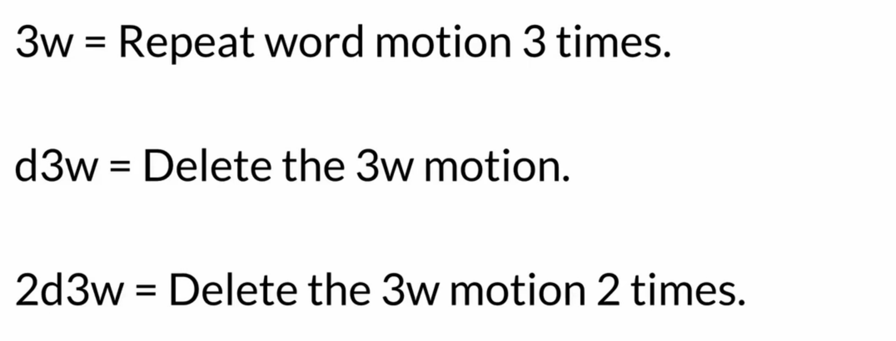
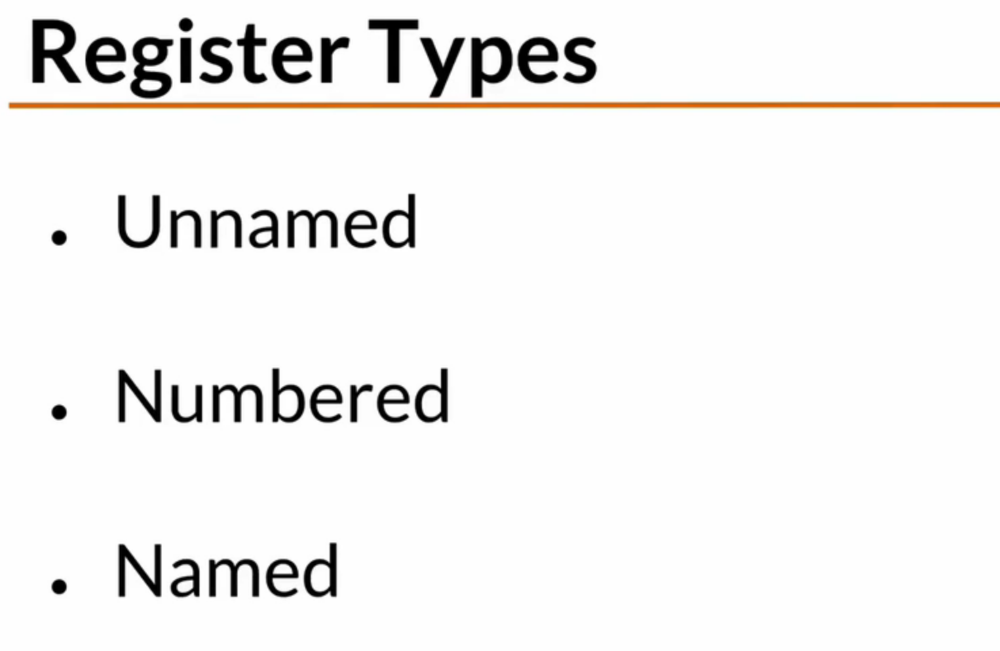

# VIM 教程

光标移动: hjkl


4j / 4k 

w 跳转下一个单词

b 跳转上一个单词

g 回到最上方

G 跳转到结尾

Ctrl + u 向上翻页

Ctrl + d 向下翻页

Fr 移动到最近的r

y 复制

yaw 复制一个单词 = yank all words

p 粘贴

u undo 撤销


---

```shell
u 撤销操作,是undo的简称

dd 剪切这一行, 就是把这一行放到了寄存器中

yy 表示复制当前行；

p 将寄存器的内容进行粘贴(在光标的下面一行) -> 如果是在句子中可能粘贴的位置是单词的前面和后面

shift + P 将寄存器的内容进行粘贴(在光标的上面一行)

j 向下

x 和 p操作进行单词的交换

x 示把光标下的字符剪切下来，并把它放在无名寄存器中

z + enter 移动视角

y2W 复制两个词, 包括其中的标点符号

2dd 删除两行


```


方向键: hjkl

翻页: ctrl + f (front) / ctrl + b(back)

vim 中开头的波浪号, 代表这是文件外面

w: 移动一个单词, 小写的w认为标点符号也是一个单词

W; 空格作为分割单词的标记

b: 和w是相反的

z + enter 移动视角

小写命令和大写命令之间往往有很多关联


按住0, 可以跳转到行开头(但是不会跳到第一个单词, 如果这一行有缩进的话)

shift + 6  跳到第一个单词

shift + 4  跳到最后一个

gg; 跳到开头

G: 跳到结尾

2gg: 跳到第二行

还可以在命令行中直接输入行号

:$ 跳到最后一行


ctrl + g 会显示filename (不会自动更行,重新按指令)

g ctrl g 会获得更多信息

:set ruler

:set ruler!

:set noruler


---

### DeletingLesson

x : 删除光标所在的字符

X; 删除光标的左侧字符

dw: 删除字符 (delete + the word)

d2w

dl 删除光标的字符 (x是它的快捷键)

dh 等于大写的X

dd 删除当前行

dj 删除当前行和下一行

dk : 删除当前行和上一行

d0 删除到开头的所有字符

d$ 删除到末尾的所有字符 (D 是它的快捷方式)

3dd 删除下面3行





. 会重复命令


---

### help system in vim

refresh your memory quickly 

在我们输入 :help后


:help dd


:help count 

:h

ctrl + o : go back

ctrl + i : jum forward 

linewise 

characterwise

Ctrl + ] : 会进行跳转

ctrl + ww 会从上方的窗口跳转到下方

命令自动补全 ctrl + d / tab 可以补全


---

### 复制粘贴


vim使用了一个寄存器的概念

dd其实类似于剪切, 会把东西存储在寄存器中

x: 其实也是剪切

p : put command (大写的p是在当前光标)


复制是y 

yank


y2w

yy: 复制一整行

撤销: u

恢复: ctrl + r





:reg查看寄存器

"0p 使用带寄存器的粘贴 

黑洞寄存器

"_dd 黑洞寄存器删除, 不会影响当前寄存器

a到z共有26个指名寄存器

"ayy 把东西放在指名寄存器a中

"Ayy 会在a寄存器后面增加写

"zdw

:reg z

:reg 1z

2"hp


